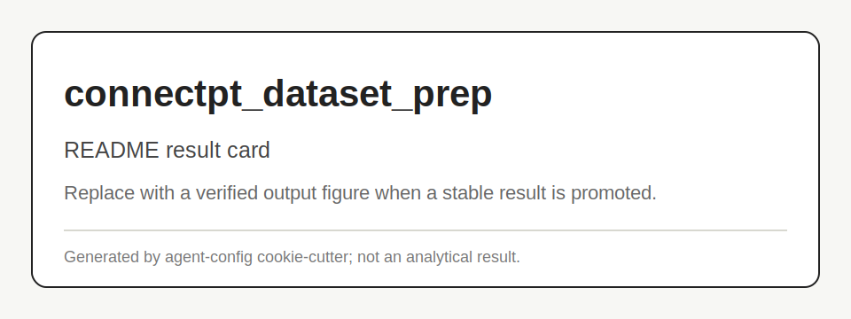

# connectpt_dataset_prep

Builds and audits real-morphology ConnectPT training samples.

## Scheme


## Main Result



## Run

Entrypoint: `cli.py`

Human:

```bash
PYTHONPATH=$PWD python -m connectpt_dataset_prep.cli status
```

Agent:

Run status/analyze after rebuild and inspect manifest plus analysis PNGs.

## Publication

No standalone publication yet.

## Next Steps / Heuristics

Heuristic: skip cities without valid gravity OD instead of silently falling back.
