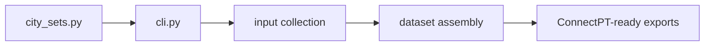
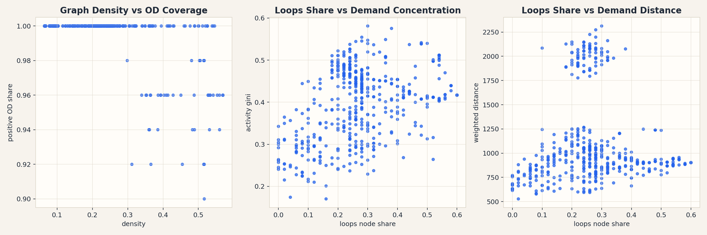

# connectpt_dataset_prep

Small dataset-builder wrapper for ConnectPT experiments. It selects city sets, runs controlled preparation jobs, and leaves outputs for downstream route-generation training/evaluation.

## System Map



## Main Result



## Run

Entrypoint: `cli.py`

Human:

```bash
uv run python cli.py --help
```

Agent: check selected city set and output manifest before running a long build; do not overwrite existing datasets unless the command explicitly says so.

## Publication

No standalone publication; support repo for ConnectPT dissertation experiments. Result image mirrors the downstream ConnectPT dataset analysis artifact.

## Next Steps / Heuristics

Heuristic: keep city sampling explicit in `city_sets.py`; every generated dataset should be reproducible from CLI args plus the selected city list.
